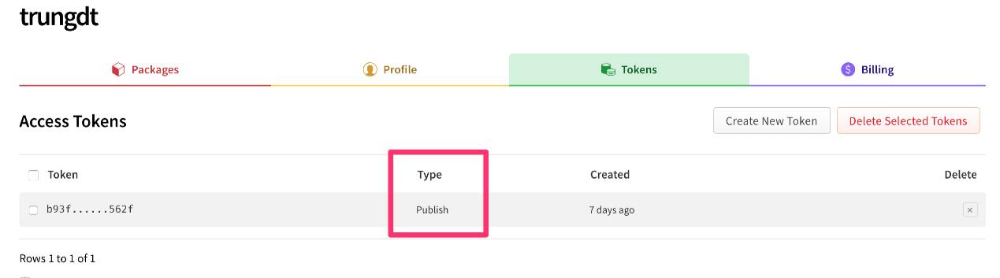
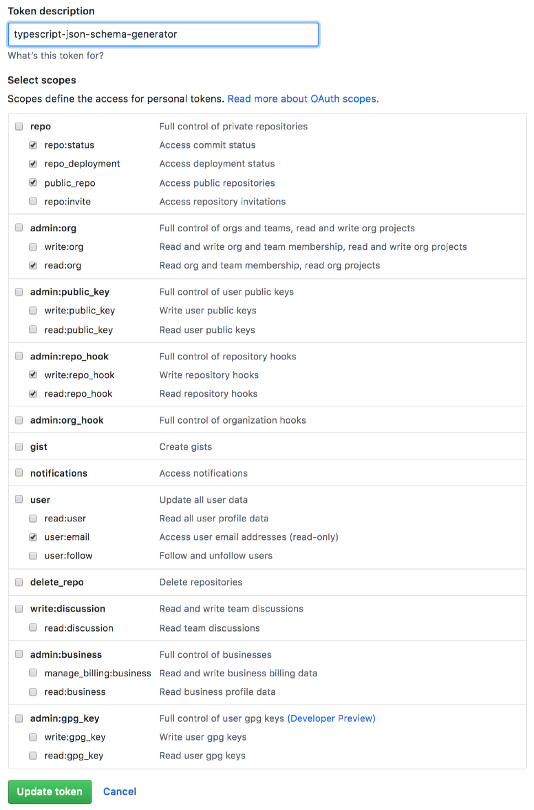
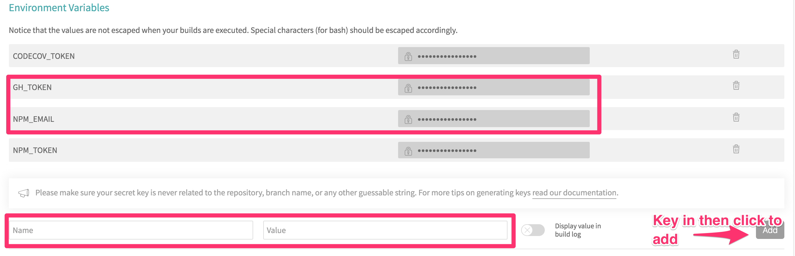

# semantic-release-sample

 
## Goals
- Typescript code based
- Strictly follow Github Flow, which is master branch is release branch. Anything commit to master will trigger release process.
- Use `husky` to verify commit message
- Use `lint-staged` to verify and auto fix code linting.
- Tag every PR that to be included to new release as `released`.
- Auto generate change log, add into each release and change log file.

## Setting up steps
1. From `https://npmjs.com`, create token that can be used to publish package. 

2. From your github account, go to [Developer Settings > Personal Access Token](https://github.com/settings/tokens) and create your own token that allow CI to push back new changes during releasing process. Select `scopes` as sample below.

3. Add your github repo to Travis, then add the following 2 tokens to Travis Environment Variables `NPM_TOKEN` and `GH_TOKEN`
 

 
4. Trigger build and enjoy. If you dont want to publish new version to NPM, set `npmPublish` to false (in `package.json`), also no need to set `NPM_TOKEN`.
